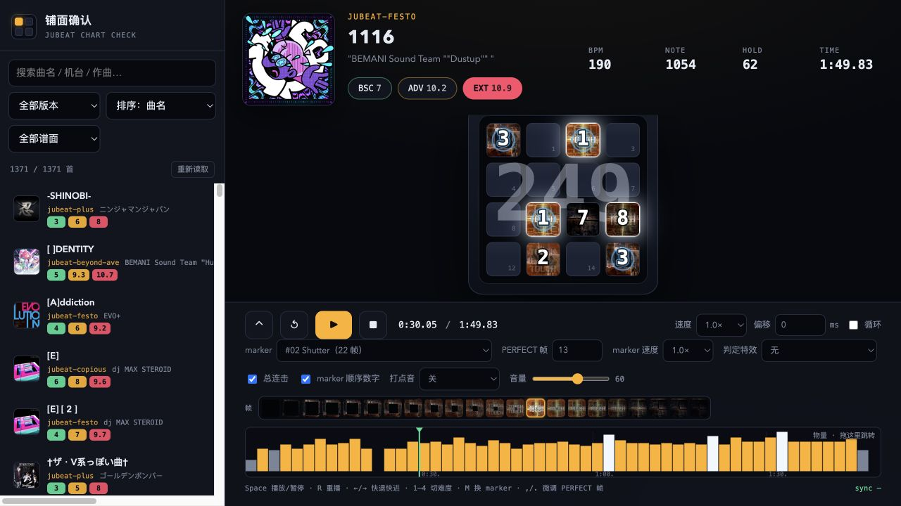

# jubeat 铺面查看器

本地跑的 jubeat 谱面（铺面）确认播放器：浏览曲库、在 4×4 面板上按谱面回放，
用 marker 的逐帧动画核对判定点。主要用途是做谱面视频、核对谱面、练谱前先看一遍节奏。



**一句话架构**：构建期把曲库（`.mcz`）展开成一棵纯静态文件树 `site/`，运行期浏览器只跟 HTTP 打交道——
没有数据库，也没有常驻后端。四种跑法（nginx 静态站 / PHP 整包 / Python 开发服务器 / Electron 桌面版）
共用同一份前端和同一套 URL 布局，所以行为完全一致。

## 目录

- [四种跑法](#四种跑法)
- [架构一：构建期](#架构一构建期)
- [架构二：运行期](#架构二运行期)
- [目录结构](#目录结构)
- [前端内部结构](#前端内部结构)
- [marker 动画怎么和判定对齐](#marker-动画怎么和判定对齐)
- [hold 的表现](#hold-的表现)
- [连击与顺序数字](#连击与顺序数字)
- [时间轴：起点、偏移、收尾](#时间轴起点偏移收尾)
- [物量条与拖动跳转](#物量条与拖动跳转)
- [性能与体积](#性能与体积)
- [下载、安装、部署](#下载安装部署)
- [自测](#自测)
- [已知限制](#已知限制)
- [版权](#版权)

## 四种跑法

| 跑法 | 怎么跑 | 运行时依赖 | 适用 |
|---|---|---|---|
| **静态站点**（推荐） | `build_site.py` 生成 `site/`，nginx / 任意静态服务器发文件 | 无 | 服务器部署、抗并发、省资源 |
| **PHP 整包** | `build_php_package.py` 打成 zip，丢到站点根目录解压 | 有 PHP 即可 | 宝塔「PHP 站点」、虚拟主机、改不了服务器配置 |
| **桌面版** | `electron/` 打包成 mac / win / linux 的 App | 无 | 当成一个本地 App 用，双击就开 |
| **开发服务器** | `cd 铺面查看器 && ./start.sh` | Python 3（标准库） | 本机调试：直接读 `.mcz`，改谱不用重新构建 |

后三种跑的都是**同一个前端**，区别只是把 `site/` 换成「实时读 `.mcz`」或者「塞进 App 里」。

## 架构一：构建期

```
music/<机台版本>/<曲名>.mcz      ← 曲库（zip：0/曲名_难度 Lv xx.mc + 0/bgm.ogg + 0/jkt*.png）
        │
        │  tools/build_site.py   展开 + 生成索引；增量（按 mtime 跳过已是最新的），--prune 清理删掉的曲
        ▼
site/                           ← 唯一的「运行时数据」，约 2.9 GB
├── index.html  static/          前端（92 KB，无构建步骤）
├── data/library.json            曲库索引：曲名 / 作曲 / 版本 / 三难度等级 / note 数 / hold 数
├── data/charts/<曲目>/<难度>.json 谱面（4103 个）
├── media/audio/<曲目>.ogg       音源（2.4 GB）
├── media/cover/<曲目>.<ext>     封面原图（202 MB）
├── media/thumb/<曲目>.jpg       列表缩略图 96px（11 MB）
└── markers/                    marker 逐帧素材（12 套，4.5 MB）
```

- **一次展开，到处跑**：`.ogg` 本身已压缩，构建只是「解 zip + 改名 + 生成索引」，
  1371 首首次约 50 秒、之后增量 3 秒左右
- **索引里就带 note / hold 数**，列表排序、筛选、物量条都不用再读谱面
- 曲库（`music/`）和产物（`site/` 等）都**不入库**，仓库里只有代码和 marker 素材

`.mcz` 内部就是一个 Malody 谱面包：

| 文件 | 说明 |
|---|---|
| `0/<曲名>_<难度> Lv<等级>.mc` | 谱面 JSON（BSC / ADV / EXT） |
| `0/bgm.ogg` | 音源（ogg / mp3 / wav 都认） |
| `0/jkt*.png` | 封面（可选） |

**曲库来源**：本项目用的 `music/` 取自
[Swan416ya/Jubeat2Malody-GUI](https://github.com/Swan416ya/Jubeat2Malody-GUI/tree/mcz-releases)
（`mcz-releases` 分支）打包好的 `.mcz`，按其机台版本目录原样放进 `music/` 即可；
自己用 Jubeat2Malody-GUI 转出来的目录也一样能丢进来。

## 架构二：运行期

浏览器只做 HTTP，**URL 布局就是前后端之间唯一的契约**，四种跑法必须一模一样：

```
/                        前端页面（index.html）
/static/*                前端 js / css
/data/library.json       曲库索引（gzip 后约 111 KB，一次拉全量，搜索筛选在浏览器本地做）
/data/markers.json       marker 清单（12 套 + 每套的帧数 / PERFECT 帧）
/data/charts/<曲目>/<难度>.json
/media/audio/<曲目>.ogg   音源，必须支持 Range（否则进度条拖不动）
/media/cover/<曲目>.<ext>
/media/thumb/<曲目>.jpg
/markers/<sheet>         marker sprite sheet
```

四种跑法各自怎么把文件发出来：

| 跑法 | 谁在发文件 | Range |
|---|---|---|
| 静态站点 | nginx / `tools/serve.py` | nginx 原生；`serve.py` 自己实现 |
| PHP 整包 | `deploy/php/index.php`（或 nginx 直发） | 两者都实现 |
| 桌面版 | `electron/site-server.js`（内置本地 HTTP 服务） | 实现 |
| 开发服务器 | `铺面查看器/player/server.py` | 实现（从 `.mcz` 里按需读） |

开发服务器是唯一「运行时读 `.mcz`」的形态：按需解包，封面/音频缓存到 `cache/`，
所以改谱面不用重新构建；代价是单进程 Python，只适合本机用。

## 目录结构

```
.
├── tools/
│   ├── build_site.py          构建：music/*.mcz → site/（增量 + prune + 多线程）
│   ├── build_php_package.py   构建：site/ → dist-php/jubeat-site-php.zip（含曲库的 PHP 整包）
│   ├── serve.py               本地预览静态站点（Range + keep-alive）
│   ├── smoke_test.py          端到端自测（静态 + 开发两种模式，32 项）
│   └── php_smoke_test.py      PHP 入口自测（21 项：Range / gzip / 304 / 目录穿越）
├── deploy/
│   ├── README.md              服务器部署步骤 + 流量估算
│   ├── nginx-site.conf.example
│   └── php/                   PHP 整包的入口文件
│       ├── index.php          静态直发 + Range + gzip（单文件，无依赖）
│       ├── .htaccess          Apache：静态优先 + 缓存 + gzip
│       ├── nginx-php.conf.example
│       └── README.txt         包内说明（宝塔 / Apache / 纯 PHP 三种环境）
├── electron/                  桌面版外壳
│   ├── main.js                窗口 + 菜单 +「选择站点目录」+ 拒绝一切系统权限申请
│   ├── site-server.js         内置本地 HTTP 服务（含 Range）
│   └── electron-builder.config.js
├── 铺面查看器/player/          开发服务器（Python）
│   ├── server.py              HTTP 路由 / Range / 静态文件
│   ├── library.py             扫描 .mcz 生成索引（并行 + 缓存，构建脚本共用）
│   ├── media.py               zip 成员读取 / 磁盘缓存 / Range 响应
│   ├── thumbs.py              封面缩略图（Pillow，缺失时退化）
│   ├── markers.py             marker 清单
│   ├── config.py              路径与环境变量
│   └── static/                前端（index.html / app.js / style.css）
├── marker/jubeat_marker_frames/  marker 素材 + manifest.json + 拆帧工具
├── music/                     曲库（.gitignore）
├── cache/                     开发模式的运行时缓存（.gitignore）
├── site/                      静态产物（.gitignore）
├── dist-php/                  PHP 整包产物（.gitignore）
└── electron/dist/             桌面版产物（.gitignore）
```

## 前端内部结构

前端是**原生 JS + Canvas，没有构建步骤**（`static/` 三个文件就是全部），`app.js` 约 2000 行，按职责分区：

| 区域 | 干什么 |
|---|---|
| 状态与工具 | `state`（notes / padRects / combo / duration）、`beatToFloat`、`buildTimeMap`（拍号 → 秒，支持变速） |
| `parseNotes` | 谱面 JSON → note 列表：算每条 note 的秒数、hold 区间、`maxSec`、顺序编号 `seq` |
| 面板 | 16 个 pad 的 DOM；命中 / arm / hold 三种状态；hold 的扇形填充 + 倒计时 |
| 打点音 | WebAudio 实时合成的四种音色（点击 / 拍手 / nyan / 太鼓），按 note 的精确时间触发 |
| marker 动画 | 从 sprite sheet 取帧画到 canvas；PERFECT 帧对齐拍点；hold 到 PERFECT 即止 |
| 物量条 | 每 2 秒一根柱子的 note 密度图，**本身就是进度条**（按住拖动跳转） |
| 曲库 | 拉一次 `library.json`，搜索 / 版本筛选 / 8 种排序全在本地做 |
| transport | 播放、暂停、变速、视听偏移、循环、按谱面收尾 |
| 渲染循环 | 单个 `requestAnimationFrame`：推进 note 状态 → 画 pad → 画 marker → 画物量 → 收尾判断 |

连击、顺序数字、hold 扇形都画在同一张 canvas 上，**绘制顺序决定叠层**（连击在最底层，marker 会压住它）。

## marker 动画怎么和判定对齐

每张 marker sheet 横向固定 5 列、帧序行优先，单帧边长 = 图宽 ÷ 5（500px → 100px，800px → 160px）。
其中有一帧是「判定完成帧」（TOUCH 完全显形），记作 **anchor**：

```
lead = (anchor + 1) / fps                        # 接近动画时长
帧号 k = floor((t − (t_note − lead)) × fps)       # 夹在 [0, anchor]
```

于是 **anchor 帧正好在 `t_note`（拍点）这一瞬间显示**，t 之后继续播剩下的帧（tap）。

- `PERFECT 帧`：就是 anchor，默认由 sheet 亮度曲线自动检测（上升段第一个达到峰值 92% 的帧），界面上可拖帧条改
- `marker 速度`：整体倍率（相当于下落式音游的 HS）
- 每套素材可以有自己的基准帧率（manifest 里的 `fps`）：**Flower Slow** 是 46 帧的「展开速度 50%」素材，
  按 60fps 播才和常规 marker 等速

## hold 的表现

1. **到位**：接近动画照常播，anchor 落在首拍上
2. **按住**：marker 动画到 PERFECT 帧**就结束**，该格改为从 12 点顺时针**逐渐填满的扇形 + 居中倒计时**
   （剩余秒数，≥10s 显示整数，否则一位小数）；跨格 hold 的头尾两格都显示扇形
3. **末拍**：倒计时走完、扇形清空——**hold 没有任何 marker 收尾动画**（跨格 hold 的尾拍那格也一样）

tap 命中后仍然会播 marker 的收尾帧 / 判定特效。

## 连击与顺序数字

- **总连击**：半透明大字压在面板正中，**画在 marker 之下**（会被 marker 挡住，和游戏里一样），可开关
- **连击以谱面位置为准**：拖进度条（尤其往回拖）时按「到该时刻为止已经过了多少条 note」重算，
  不会留着旧数字继续累加；往回拖立即下降，往前拖立即追上
- **marker 顺序数字**：同一秒内按出现先后编号 1、2、3…，**同一时刻一起出现（要一起按）的共用同一个编号**，
  这一批数字带**蓝色光晕 + 往外扩散的光环**（同一批同步呼吸，一眼看出哪些是同时按的），
  数字跟 marker 一起出现、一起消失，可开关

## 时间轴：起点、偏移、收尾

- `t_chart = audio.currentTime + offset(ms) − 谱面自身起点偏移`
- **收尾**：`duration = min(最后一个 note 的秒数 + 1.2s, 音源长度)`。
  曲尾常有一段既没 note、又没声音的空白（抽查 40 首：中位 4.4 秒、最长 9.4 秒），
  按谱面收尾后进度条不再空转；留的 1.2 秒是给最后一个 marker 播完判定动画用的
- 变速播放只改 `playbackRate`，marker 和打点音都跟着音频时间走，所以不会漂

## 物量条与拖动跳转

底部按 **2 秒一段**画出整首歌的 note 密度（越高越黄、峰值白色），**它就同时是进度条**：

- 按住拖动 = 跳转，松手后恢复原来的播放状态
- 悬停显示该时段有多少 note
- 柱子按 `duration` 铺满整条，所以「看得到柱子的地方就有内容」

## 性能与体积

| 项 | 做法 |
|---|---|
| 体积 | 2.9 GB 里 2.4 GB 是音源（Ogg 已压过，压不动）；封面原图按需加载，列表只用 96px 缩略图（11 MB） |
| 带宽 | 一首歌 ≈ 2 MB，听一遍 ≈ 2 MB；索引 gzip 后 111 KB，只拉一次 |
| 并发 | 静态部署时由 nginx 发文件，2 核 2G 够用；音源走 Range，拖进度条也只取需要的块 |
| 缓存 | `media/` `markers/` `static/` 长缓存（7 天）+ ETag/304；`data/*.json` 与 `index.html` 走 no-cache 随时生效 |
| 首屏 | 只拉 `index.html` + 前端 + 索引（约 200 KB）和当前可见行的缩略图 |

## 下载、安装、部署

### 桌面版（Release）

Release 里放的是**不带曲库**的包（每个约 100 MB；GitHub 单个附件上限 2 GB，而带曲库的整包 2.9 GB 传不上去）：

| 平台 | 文件 |
|---|---|
| macOS（Apple Silicon / Intel） | `jubeatViewer-0.3.0-mac-arm64.zip` / `-mac-x64.zip` |
| Windows（x64 / ARM64） | `jubeatViewer-0.3.0-win-x64.zip` / `-win-arm64.zip` |
| Linux（x86_64 / ARM64） | `jubeatViewer-0.3.0-linux-x86_64.AppImage` / `-linux-arm64.AppImage` |

解压后直接运行；如果提示还没找到站点数据，用菜单「文件 → 选择站点目录（site/）」指向自己构建的 `site/`（会被记住）。
macOS 上没做签名，第一次要右键「打开」，或者 `xattr -dr com.apple.quarantine jubeatViewer.app`。

### 自己打包（连曲库一起）

```bash
python3 tools/build_site.py --out site --prune     # 先把曲库展开成 site/
cd electron && npm install
npm run dist                                       # 默认把 site/ 打进包里（每个平台约 2.9 GB）
NO_WINE=1 npm run dist:win                         # 没有 wine 的机器上打 Windows 包（跳过 exe 图标/版本信息）
NO_SITE=1 npm run dist                             # 反过来：只出不带曲库的轻量包
```

### 服务器：纯静态（推荐）

```bash
python3 tools/build_site.py --out site --prune
rsync -av --delete site/ root@your-server:/www/wwwroot/jubeat/
```

宝塔：加站点（纯静态）→ 根目录指向站点目录 → 把 `deploy/nginx-site.conf.example` 里的
`location` / `gzip` 段贴进站点配置 → 开 HTTPS + HTTP/2。详见 [deploy/README.md](deploy/README.md)。

### 服务器：PHP 整包（解压即用）

```bash
python3 tools/build_php_package.py                 # → dist-php/jubeat-site-php.zip（约 2.6 GB）
```

把 zip 丢到宝塔站点根目录解压即可，包内 `README.txt` 写了宝塔 / Apache / 纯 PHP 三种环境的步骤；
`index.php` 会自己发静态文件（含音源 Range 与 gzip），贴上 `nginx-php.conf.example` 之后改由 nginx 直发。

## 自测

```bash
python3 tools/smoke_test.py --build    # 静态 + 开发两种模式，32 项（首页/索引/谱面/音源 Range/封面/缩略图/缓存/gzip/404）
python3 tools/php_smoke_test.py        # PHP 入口，21 项（各种 Range、416、gzip、ETag/304、HEAD、目录穿越）
```

两个脚本都会临时起服务、造 fixture、自己清理，不需要真实曲库（PHP 那个需要机器上有 `php`）。

## 已知限制

- **Safari 不支持 Ogg Vorbis**：没声音就换 Chrome / Edge；另外浏览器要求先有一次页面交互才允许播放
- **曲库里有 48 个包没被索引**：它们的谱面文件名是 `曲名_难度.mc`（缺 `Lv<等级>`），
  目前只认 `曲名_难度 Lv<等级>.mc`。需要的话可以放开这条规则（等级改从谱面 JSON 里读）
- **5 个封面在源包里就是坏的 PNG**（HEKIREKI、こどなの階段、となりのトトロ feat_sayurina、マスターピース、女々しくて），
  列表里退化成 ♪ 占位，没有别的影响

## 版权

- 代码：个人项目，未附 License，仅供学习参考
- **曲库来源**：[Swan416ya/Jubeat2Malody-GUI](https://github.com/Swan416ya/Jubeat2Malody-GUI/tree/mcz-releases)
  整理并打包的 jubeat `.mcz`（Malody 谱面格式）；本项目只做浏览与回放，曲库本身不入库
- **曲目、封面、jubeat 的名称与 marker 图案版权归 KONAMI Digital Entertainment 及各原作者**。
  `marker/` 里的素材来自社区公开配布（yuisin、Amy、jujube 项目等），仅供个人核对谱面 / 制作谱面视频使用，
  请勿商用或再分发；`music/` 与构建产物（`site/`、`dist-php/`、`electron/dist/`）都不入库，
  公网部署建议加 Basic Auth 或 IP 白名单
