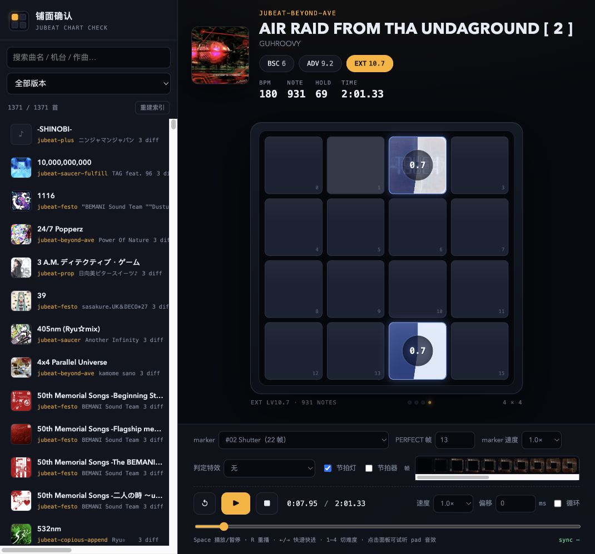

# jubeat 铺面查看器

本地跑的 jubeat 谱面（铺面）确认播放器：浏览曲库、在 4×4 面板上按谱面回放，
用**官方 marker 的逐帧动画**核对判定点。主要用途是做铺面视频、核对铺面、练谱前先看一遍节奏。



**部署形态：纯静态**。构建脚本把 `music/` 里的 `.mcz` 展开成 `site/`（音频 / 封面 / 缩略图 /
谱面 / 索引），之后 nginx 直接发文件——运行时不需要 Python、PHP 或任何后端服务。

## 功能

- **曲库浏览**：搜索曲名/作曲/机台版本，列表左侧带封面缩略图；索引一次拉全量（gzip 后 ~93 KB），搜索与筛选在浏览器本地完成，输入即出
- **排序**：曲名 / 推出版本（旧→新）/ BSC、ADV、EXT 难度（高→低）/ BSC、ADV、EXT note 数（多→少）
- **列表信息**：曲名下面直接显示三个难度的等级数字（BSC 绿、ADV 黄、EXT 红，和右侧难度按钮同色）
- **难度切换**：BSC / ADV / EXT，统计 BPM、NOTE、HOLD、时长
- **marker 逐帧动画**：12 套素材（Shutter / Flower / Shutter Blue / clan / saucer / Yukiko-tan …），
  PERFECT 帧严格落在拍点上（见下）
- **hold 三段表现**：到位 → 扇形填充 + 倒计时 → 末拍后播完剩余动画（见下）
- **判定特效**：可选一张特效 sheet 在命中瞬间叠加播放
- **面板叠层显示**：可开关的**总连击**（半透明大字压在面板正中，像游戏里的 combo 显示）与
  **marker 顺序数字**（同一秒内按出现先后编号 1、2、3…，命中后还会多停留约 0.5 秒方便看清）
- **长押筛选**：只要长押 / 只要非长押（按谱面里真实的 hold 数量判断，比只看曲名 `[ 2 ]` 更准）
- **物量显示**：底部按 2 秒一段画出整首歌的 note 密度，**进度条就在这条物量图上拖动**，悬停显示该时段的 note 数
- **节拍灯 / 节拍音**：核对 marker 有没有踩在拍上；节拍音可选「点击 / 拍手 / 猫娘 nyan / 太鼓（咚·咔）」，音量可调（都是 WebAudio 实时合成，不带音频素材）
- **选项可折叠**：收起后只保留播放控制 + 物量条，给面板留出更大空间；收起状态会被记住
- **播放控制**：播放/暂停、0.5×–2.0× 变速、进度拖拽、循环、视听偏移（ms）
- **URL 直达**：`?song=<曲目 id>&chart=<.mc 文件名>&t=<秒>&paused=1`
- **桌面端两列信息**：左边版本/曲名/作曲/难度，右边 BPM/NOTE/HOLD/TIME 与连击；封面同步放大
- **移动端**：曲库变成侧边抽屉（选完自动收起），选项变成贴在播放控制上方的浮层，面板按可用高度自适应

## 快速开始

需要 Python 3（只用标准库，用来构建 / 预览；线上不需要）。

```bash
# 1) 曲库放到仓库根目录 music/（不入库）
#    music/<机台版本>/<曲名>.mcz

# 2) 展开成静态站点（1419 首约 50 秒、2.9 GB；之后是增量）
python3 tools/build_site.py --out site --prune

# 3) 本地预览（带 Range，音源可以拖进度条）
python3 tools/serve.py site --port 8000
#    → http://127.0.0.1:8000/
```

部署到服务器（宝塔 + nginx）见 **[deploy/README.md](deploy/README.md)**：
本质就是 `rsync site/ 到站点目录` + 贴一段 nginx 配置。

### 曲库格式

`.mcz` 就是一个 zip：

| 文件 | 说明 |
|---|---|
| `0/<曲名>_<难度> Lv<等级>.mc` | Malody 谱面 JSON（BSC/ADV/EXT） |
| `0/bgm.ogg` | 音源（ogg / mp3 / wav 都认） |
| `0/jkt*.png` | 封面（可选） |

`Jubeat2Malody-GUI` 转换出来的目录直接能用，丢进 `music/` 即可。

## 目录结构

```
.
├── tools/
│   ├── build_site.py        # 构建：music/*.mcz → site/（增量 + 可 prune）
│   ├── serve.py             # 本地预览静态站点（支持 Range）
│   └── smoke_test.py        # 端到端自测（两种模式 29 项检查）
├── deploy/
│   ├── README.md            # 部署步骤 + 流量估算
│   └── nginx-site.conf.example
├── 铺面查看器/player/
│   ├── static/              # 前端（原生 JS + Canvas，无构建步骤）
│   ├── server.py            # 可选：开发服务器，直接读 .mcz，免构建
│   ├── library.py           # 曲库索引（并行扫描 + 缓存）
│   ├── media.py             # zip 成员读取 / 磁盘缓存 / Range 响应
│   ├── thumbs.py            # 封面缩略图（Pillow 或 macOS sips）
│   ├── markers.py           # marker 清单
│   └── config.py            # 路径与环境变量
├── marker/                  # marker 素材（sheet + manifest）
├── music/                   # 曲库（.gitignore）
├── cache/                   # 开发模式的运行时缓存（.gitignore）
└── site/                    # 构建产物，上传到服务器（.gitignore）
```

### 两种跑法

| 模式 | 命令 | 特点 |
|---|---|---|
| **静态站点（推荐 / 部署用）** | `build_site.py` + `serve.py` 或 nginx | 零后端、最省资源、抗并发；曲库变更要重新构建（增量，很快） |
| **开发服务器（本机调试）** | `cd 铺面查看器 && ./start.sh` | 直接从 `.mcz` 按需解包，改谱面不用重建；单进程 Python |

两种模式**共用同一套 URL 布局和同一份前端**，所以行为完全一致：

```
data/library.json                曲库索引（含版本、难度、文件位置）
data/markers.json                marker 清单
data/charts/<曲目>/<难度>.json     谱面
media/audio/<曲目>.ogg            音源
media/cover/<曲目>.<ext>          封面
media/thumb/<曲目>.jpg            列表缩略图（96px）
markers/<sheet>                  marker 素材
```

## marker 动画怎么和判定对齐

每张 marker sheet 横向固定 5 列、帧序行优先，单帧边长 = 图宽 ÷ 5（500px→100px，800px→160px）。
其中有一帧是「判定完成帧」（TOUCH 完全显形），记作 **anchor**：

```
lead = (anchor + 1) / fps                        # 接近动画时长
帧号 k = floor((t_chart − (t_note − lead)) × fps) # 夹在 [0, anchor]
```

于是 **anchor 帧正好在 `t_note`（拍点）这一瞬间显示**，t 之后继续播剩下的帧。

- `PERFECT 帧`：anchor，默认由 sheet 亮度曲线自动检测（上升段第一个达到峰值 92% 的帧），可手动拖帧条改
- `marker 速度`：整体倍率（相当于下落式音游的 HS）
- 每套素材可以有自己的基准帧率（manifest 里的 `fps`）：**Flower Slow** 是 46 帧的「展开速度 50%」素材，按 60fps 播才和常规 marker 等速

## hold 的三段表现

1. **到位**：接近动画照常播，anchor 落在首拍上
2. **按住**：marker 动画停住（冻结帧压到 15% 当底纹），该格改为从 12 点顺时针**逐渐填满的扇形 + 居中倒计时**（剩余秒数，≥10s 显示整数，否则一位小数）；跨格 hold 的头尾两格都显示扇形
3. **末拍**：倒计时走完、扇形清空——**hold 没有任何 marker 收尾动画**（跨格 hold 的尾拍那格也一样，格子只会闪一下 LED）

（tap 判定命中后仍然会播 marker 的收尾帧 / 判定特效。）

## 快捷键

| 按键 | 作用 |
|---|---|
| `Space` | 播放 / 暂停 |
| `R` | 重播 |
| `←` / `→` | 快退 / 快进 5s |
| `1`–`4` | 切换难度 |
| `M` | 切换 marker |
| `,` / `.` | PERFECT 帧 −1 / +1 |

切歌 / 切难度会先停止播放并把进度归零，不会沿用上一首的进度。
进度条在底部物量图里：按住拖动即可跳转，松手后继续播放。

## 自己加 marker 素材

1. sheet 放进 `marker/jubeat_marker_frames/markers/<编号_名称>/`，命名 `sprite_sheet.png`，
   附 `meta.json`（帧数 / 单帧尺寸 / 网格）
2. 在 `manifest.json` 里加一条（`frames` / `cell` / `cols` / `rows` / `sheet` / `anchor` / `fps`），
   或用 `marker/jubeat_marker_frames/tools/split_marker_sheet.py` 先拆帧确认 anchor
3. 重新构建（静态模式）或刷新页面（开发模式）；anchor 也能在界面上直接拖帧条改

## 自测

```bash
python3 tools/smoke_test.py --build     # 建一个 5 首的临时站点，静态 + 开发两种模式各测一遍
```

覆盖：首页/前端资源、曲库索引、marker 清单、谱面、音源整条 + Range、封面、缩略图、
缓存头、gzip 与 ETag/304、非法路径 404。

## 常见问题

- **没声音**：音源是 Ogg Vorbis，Chrome / Edge / Chromium 系都支持；**Safari 不支持 Vorbis**。
  另外浏览器要求先有交互才允许播放，点一下页面再按空格。
- **静态站点打开是空白/没有曲目**：先跑 `tools/build_site.py`，并用 `tools/serve.py` 预览
  （直接双击 `index.html` 用 `file://` 打开会因为没有 HTTP 而拿不到数据）。
- **nginx 返回 403/404**：站点根目录要指向 `site/`（不是仓库根目录）。
- **想少占磁盘**：`site/` 可以只保留 `media/audio` + `data` + 前端，封面删掉后列表会显示 ♪ 占位。
- **换曲库位置**：`JUBEAT_LIBRARY=/path/to/music`（仅开发服务器与构建脚本用）。

## 版权

- 代码：个人项目，未附 License，仅供学习参考。
- **曲目、封面、jubeat 的名称与 marker 图案版权归 KONAMI Digital Entertainment 及各原作者**。
  `marker/` 里的素材来自社区公开配布（yuisin、Amy、jujube 项目等），仅供个人核对铺面 / 制作谱面视频使用，
  请勿商用或再分发；`music/` 与构建产物 `site/` 都不入库，公网部署建议加访问保护。
